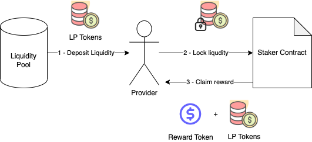

# LP Project

In this project you're going to extend your previous project by writing a specific type of liquidity pool contract based off of Uniswap V2's decentralized exchange protocol. In doing so you will:

- Learn how liquidity pools work
- Write a Uniswap v2 style liquidity pool contract
- Deploy to a testnet
- Update your Space ICO contract to move its funds to your pool contract
- Extend a frontend for liquidity providers to manage their ETH-SPC LP tokens

LMS Link can be found [here](https://learn.0xmacro.com/training/project-lp/p/1).

## Setup

See [README-Setup.md](./README-Setup.md)

## Technical Spec

### ICO Contract Updates

- Add a withdraw function to your ICO contract that allows you to **move the invested funds out of the ICO contract and into the treasury address.**
- In one of your tests, test the end-to-end process of raising funds via the ICO, withdrawing them to the treasury, and then depositing an even worth of ETH and SPC into your liquidity contract.
<!-- TODO: PEDRO, DO NOT FORGET THE ABOVE!! -->

### Liquidity Pool Contract

Implement a liquidity pool for ETH-SPC. You will need to:

- Write an ERC-20 contract for your pool's LP tokens
- Write a liquidity pool contract that:
  - Mints LP tokens for liquidity deposits (ETH + SPC tokens)
  - Burns LP tokens to return liquidity to holder
  - Accepts trades with a 1% fee

You can use [OpenZeppelin's implementation](https://github.com/OpenZeppelin/openzeppelin-contracts/blob/master/contracts/token/ERC20/ERC20.sol) for the LP tokens.

### Router contract

Transferring tokens to an LP pool requires two transactions:

1. Trader grants allowance on the Router contract for Y tokens.
1. Trader executes a function on the Router which pulls the funds from the Trader and transfers them to the LP Pool.

Write a router contract to handles these transactions. Be sure it can:

- Add and remove liquidity, without wasting or donating user funds.
- Swap tokens, allowing traders to specify a minimum amount out for the output token.

Additional notes:

- Neither the liquidity pool nor the router does does not need to deal with the 2% SPC tax. [Source](https://discord.com/channels/870313767873962014/1068580094559408238/1070812008997462056)

## Code Coverage Report

| File                 | % Stmts | % Branch | % Funcs | % Lines | Uncovered Lines |
| -------------------- | ------- | -------- | ------- | ------- | --------------- |
| contracts/           | 100     | 98.86    | 100     | 100     |                 |
| Ico.sol              | 100     | 100      | 100     | 100     |                 |
| Ownable.sol          | 100     | 100      | 100     | 100     |                 |
| SpaceCoin.sol        | 100     | 100      | 100     | 100     |                 |
| SpaceLP.sol          | 100     | 96.43    | 100     | 100     |                 |
| SpaceRouter.sol      | 100     | 100      | 100     | 100     |                 |
| contracts/libraries/ | 100     | 100      | 100     | 100     |                 |
| Math.sol             | 100     | 100      | 100     | 100     |                 |
| SafeERC20.sol        | 100     | 100      | 100     | 100     |                 |
| SwapMath.sol         | 100     | 100      | 100     | 100     |                 |
| All files            | 100     | 99.04    | 100     | 100     |                 |

## Design Exercise Answer

<!-- Answer the Design Exercise. -->
<!-- In your answer: (1) Consider the tradeoffs of your design, and (2) provide some pseudocode, or a diagram, to illustrate how one would get started. -->

### Staking Tradeoffs

> Many liquidity pools incentivize liquidity providers by offering additional rewards for staking their LP tokens - What are the tradeoffs of staking? Consider the tradeoffs for the LPs and for the protocols themselves.

**Positives consequences:**

- Staking rewards creates incentives for liquidity providers to add and keep liquidity in LPs.
  - Having enough liquidity on the pool for a project's token can make or break the project.

**Negative consequences:**

- Rewards must be paid by the staking program creator.
  - Even if the tokens can be created out of thin air, if there is a perception of value for that token, other market participants will be willing to pay money to own it, which means the token can be ascribed a theoretical market price.
- Staking programs can be used to siphon liquidity from one protocol into another.
  - i.e: Sushiswap Vampire Attack on Uniswap.

### Staking functionality

> Describe (using pseudocode) how you could add staking functionality to your LP.

Staking would be implemented via a staker contract that locks up LP tokens for a predetermined amount of time and rewards stakers for the locked liquidity. Once the lockup period is over, providers can claim back the LP Tokens + the rewards. The high-level overview of the reward system would be as follows:



**Staker Initialization**

The staker contract is initialized by setting:

- The liquidity pool token that can be staked.
- The reward token that will be offered.
- The minimum amount of reward that must be deposited in the contract for staking to begin.
- The duration of the incentive in blocks. This is to prevent miners from getting an unfair advantage in the reward partition by skewing the block timestamp.

```solidity
constructor(IERC20 _lpToken, IERC20 _rewardToken, uint256 _minimumReward, uint256 _stakingDurationBlocks) {
  lpToken = _lpToken;
  rewardToken = _rewardToken;
  stakingEndBlock = block.number + _stakingDurationBlocks;
  minimumReward = _minimumReward;
}
```

**Staking LP Tokens:**

LP Tokens can only be staked once the staker has been suficciently funded with rewards and while the staking period is still active:

```solidity
struct Staker {
  uint256 stakedliquidityBlocks;
  uint256 stakedLpTokens;
  bool claimedReward;
}

mapping(address => Staker) public stakers;

// onlyWhenActive ensures staking period is still active
function stake(uint256 _lpIn) external onlyWhenActive {
  // Ensures the contract has been funded with the minimum reward before accepting stakes
  if (rewardToken.balanceOf(address(this)) < minimumReward) {
    revert MinimumRewardNotMet();
  }

  // Calculate liquidity blocks for the staker
  uint256 _liquidityBlocks = _lpIn * (stakingEndBlock - block.number);
  if (_liquidityBlocks == 0) {
    revert InvalidStake();
  }

  // Increment liquidity blocks for the staker and the program
  Staker storage _staker = stakers[msg.sender];
  _staker.stakedLpTokens += _lpIn;
  _staker.stakedliquidityBlocks += _liquidityBlocks;
  totalLiquidityBlocks += _liquidityBlocks;

  // Transfer LP tokens to the contract and keep them locked until staking period is over
  lpToken.safeTransferFrom(msg.sender, address(this), _lpIn);
}
```

**Claiming rewards + LP Tokens:**

Once locking period is over, the staker can claim back their LP Tokens and their proportional share of the rewards.

```solidity
// onlyWhenOver ensures staking period is over
function claimReward() external onlyWhenOver {
  // Lock the reward to be distributed as soon as the first staker claims it. This ensures
  // a fair distribution for everyone.
  if (lockedReward == 0) {
    lockedReward = rewardToken.balanceOf(address(this));
  }

  // Ensure the staker has not claimed the reward already
  Staker storage _staker = stakers[msg.sender];
  if (_staker.claimedReward) {
    revert RewardAlreadyClaimed();
  }

  // Calculate reward for the staker
  uint256 _reward = (_staker.stakedliquidityBlocks * lockedReward) / totalLiquidityBlocks;

  // Mark reward as claimed
  _staker.claimedReward = true;

  // Transfer reward to the staker
  rewardToken.safeTransfer(msg.sender, _reward);

  // Transfer back LP tokens to the staker
  lpToken.safeTransfer(msg.sender, _staker.stakedLpTokens);
}
```

**Notes:**

Since this is a design exercise, the code was not hardened against potential attacks. It is mostly here to illustrate the idea

**Benefits of the approach:**

- Simple: The contract is easy to implement and understand.
- Modular: This staking mechanism works with any ERC-20 LP Token and any ERC-20 Reward token.

**Downsides of the approach:**

- Requires a predetermined end date for all stakers.
- Simplistic reward math.

## Testnet Deploy Information

| Contract  | Address Etherscan Link                                                          |
| --------- | ------------------------------------------------------------------------------- |
| SpaceCoin | https://sepolia.etherscan.io/address/0xb5449af96bC7793266255342e832A3D2F25a2126 |
| ICO       | https://sepolia.etherscan.io/address/0x00f621b0b81827A7e1e58951C4F8C94383A3C42A |
| Router    | https://sepolia.etherscan.io/address/0x77f43bf423226a6e66D23C176cE03AF80b7988ac |
| Pool      | https://sepolia.etherscan.io/address/0x9Aae7B61653257e5DfF1535bA67aFFA7EB4BFe93 |

# Hardhat commands

This project demonstrates a basic Hardhat use case. It comes with a sample contract, a test for that contract, and a script that deploys that contract.

Try running some of the following tasks:

```shell
npx hardhat help
npx hardhat test
REPORT_GAS=true npx hardhat test
npx hardhat node
npx hardhat run scripts/deploy.ts
```
